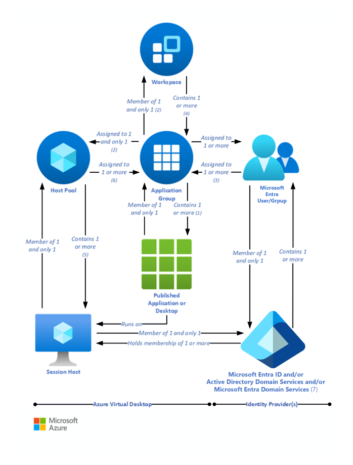

# DeployAzureAVD

## Overview
This project showcases the deployment and configuration of an Azure Virtual Desktop (AVD) environment integrated with an Active Directory domain controller. It involved setting up essential components to create a functional and secure virtual desktop infrastructure. The project demonstrates proficiency in various Azure services and configuration techniques.

## Purpose
The primary objective of this project was to:
* Deploy and configure an AVD environment.
* Integrate it with Active Directory for user and group management.
* Ensure proper setup of FSLogix and MSIX for profile and application management.
* Validate the deployment through thorough testing and demonstration.

## Project Diagram

## Key Takeaways
1. Azure Virtual Desktop (AVD) Deployment
- VNet Setup: Configured a secure virtual network and subnets.
- Domain Controller: Deployed and managed a Windows Server VM with Active Directory.

2. Azure Active Directory (AAD) Integration
- Global Administrator: Set up and configured administrative access.
- AD Connect: Synchronized on-premises AD with Azure AD.

3. User and Group Management
- Creation: Managed users and groups in AD DS and AAD.
- Group Assignments: Controlled access to resources and applications.

4. Storage Configuration
- Storage Account: Set up and secured file shares with AD DS authentication.
- Permissions: Managed access levels for different user groups.

5. Multi-session VM Management
- VM Creation: Deployed Windows multi-session VMs with Microsoft 365 Apps.
- Image Management: Created and used VM images for scaling.

6. Host Pools and Application Groups
- Host Pools: Configured and deployed host pools.
- Application Groups: Added and managed application groups for user access.

7. Security and Testing
- MFA: Implemented multi-factor authentication using conditional access for enhanced security.
- Validation: Verified functionality through adding QR to my personal device in the Authenticator app.

## Demonstration
The project video has been recorded and uploaded to Microsoft Stream. The video demonstrates the setup, configuration, and validation of the AVD environment, including all required tasks. Here's the [link](https://drive.google.com/file/d/1zSAklFIwaa653S_ckipLIe9t7u-UtLTi/view?usp=sharing) to the video.

Thank you for reviewing my project. If you have any questions or feedback, please feel free to reach out.